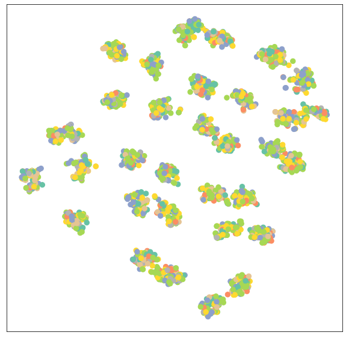
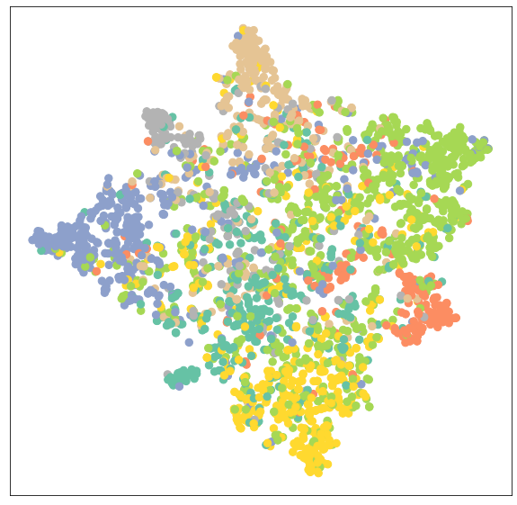
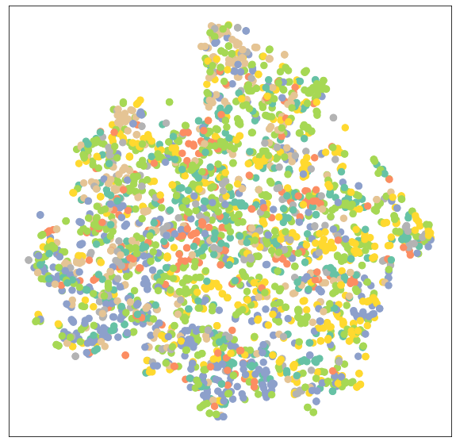
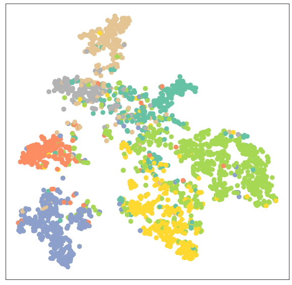
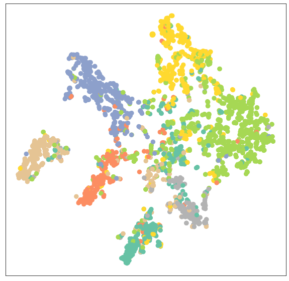

```python
import torch
torch.__version__
```


    '1.9.0+cu102'


```python
!pip install torch-scatter -f https://pytorch-geometric.com/whl/torch-1.9.0+cu102.html
!pip install torch-sparse -f https://pytorch-geometric.com/whl/torch-1.9.0+cu102.html
!pip install torch-cluster -f https://pytorch-geometric.com/whl/torch-1.9.0+cu102.html
!pip install torch-spline-conv -f https://pytorch-geometric.com/whl/torch-1.9.0+cu102.html
!pip install torch-geometric
```

    Looking in links: https://pytorch-geometric.com/whl/torch-1.9.0+cu102.html
    Requirement already satisfied: torch-scatter in /usr/local/lib/python3.7/dist-packages (2.0.7)
    Looking in links: https://pytorch-geometric.com/whl/torch-1.9.0+cu102.html
    Requirement already satisfied: torch-sparse in /usr/local/lib/python3.7/dist-packages (0.6.10)
    Requirement already satisfied: scipy in /usr/local/lib/python3.7/dist-packages (from torch-sparse) (1.4.1)
    Requirement already satisfied: numpy>=1.13.3 in /usr/local/lib/python3.7/dist-packages (from scipy->torch-sparse) (1.19.5)
    Looking in links: https://pytorch-geometric.com/whl/torch-1.9.0+cu102.html
    Requirement already satisfied: torch-cluster in /usr/local/lib/python3.7/dist-packages (1.5.9)
    Looking in links: https://pytorch-geometric.com/whl/torch-1.9.0+cu102.html
    Requirement already satisfied: torch-spline-conv in /usr/local/lib/python3.7/dist-packages (1.2.1)
    Requirement already satisfied: torch-geometric in /usr/local/lib/python3.7/dist-packages (1.7.1)
    Requirement already satisfied: jinja2 in /usr/local/lib/python3.7/dist-packages (from torch-geometric) (2.11.3)
    Requirement already satisfied: networkx in /usr/local/lib/python3.7/dist-packages (from torch-geometric) (2.5.1)
    Requirement already satisfied: python-louvain in /usr/local/lib/python3.7/dist-packages (from torch-geometric) (0.15)
    Requirement already satisfied: pandas in /usr/local/lib/python3.7/dist-packages (from torch-geometric) (1.1.5)
    Requirement already satisfied: requests in /usr/local/lib/python3.7/dist-packages (from torch-geometric) (2.23.0)
    Requirement already satisfied: scipy in /usr/local/lib/python3.7/dist-packages (from torch-geometric) (1.4.1)
    Requirement already satisfied: numpy in /usr/local/lib/python3.7/dist-packages (from torch-geometric) (1.19.5)
    Requirement already satisfied: scikit-learn in /usr/local/lib/python3.7/dist-packages (from torch-geometric) (0.22.2.post1)
    Requirement already satisfied: googledrivedownloader in /usr/local/lib/python3.7/dist-packages (from torch-geometric) (0.4)
    Requirement already satisfied: tqdm in /usr/local/lib/python3.7/dist-packages (from torch-geometric) (4.41.1)
    Requirement already satisfied: rdflib in /usr/local/lib/python3.7/dist-packages (from torch-geometric) (5.0.0)
    Requirement already satisfied: MarkupSafe>=0.23 in /usr/local/lib/python3.7/dist-packages (from jinja2->torch-geometric) (2.0.1)
    Requirement already satisfied: decorator<5,>=4.3 in /usr/local/lib/python3.7/dist-packages (from networkx->torch-geometric) (4.4.2)
    Requirement already satisfied: pytz>=2017.2 in /usr/local/lib/python3.7/dist-packages (from pandas->torch-geometric) (2018.9)
    Requirement already satisfied: python-dateutil>=2.7.3 in /usr/local/lib/python3.7/dist-packages (from pandas->torch-geometric) (2.8.1)
    Requirement already satisfied: idna<3,>=2.5 in /usr/local/lib/python3.7/dist-packages (from requests->torch-geometric) (2.10)
    Requirement already satisfied: certifi>=2017.4.17 in /usr/local/lib/python3.7/dist-packages (from requests->torch-geometric) (2021.5.30)
    Requirement already satisfied: urllib3!=1.25.0,!=1.25.1,<1.26,>=1.21.1 in /usr/local/lib/python3.7/dist-packages (from requests->torch-geometric) (1.24.3)
    Requirement already satisfied: chardet<4,>=3.0.2 in /usr/local/lib/python3.7/dist-packages (from requests->torch-geometric) (3.0.4)
    Requirement already satisfied: joblib>=0.11 in /usr/local/lib/python3.7/dist-packages (from scikit-learn->torch-geometric) (1.0.1)
    Requirement already satisfied: pyparsing in /usr/local/lib/python3.7/dist-packages (from rdflib->torch-geometric) (2.4.7)
    Requirement already satisfied: six in /usr/local/lib/python3.7/dist-packages (from rdflib->torch-geometric) (1.15.0)
    Requirement already satisfied: isodate in /usr/local/lib/python3.7/dist-packages (from rdflib->torch-geometric) (0.6.0)
    


```python
from torch_geometric.datasets import Planetoid
from torch_geometric.transforms import NormalizeFeatures

dataset = Planetoid(root='data/Planetoid', name='Cora', transform=NormalizeFeatures())
data = dataset[0]
```


```python
print()
print(f'Dataset: {dataset}:')
print('======================')
print(f'Number of graphs: {len(dataset)}')
print(f'Number of features: {dataset.num_features}')
print(f'Number of classes: {dataset.num_classes}')

print()
print(data)
print('======================')

print(f'Number of nodes: {data.num_nodes}')
print(f'Number of edges: {data.num_edges}')
print(f'Average node degree: {data.num_edges / data.num_nodes:.2f}')
print(f'Number of training nodes: {data.train_mask.sum()}')
print(f'Training node label rate: {int(data.train_mask.sum()) / data.num_nodes:.2f}')
print(f'Contains isolated nodes: {data.contains_isolated_nodes()}')
print(f'Contains self-loops: {data.contains_self_loops()}')
print(f'Is undirected: {data.is_undirected()}')
```

    
    Dataset: Cora():
    ======================
    Number of graphs: 1
    Number of features: 1433
    Number of classes: 7
    
    Data(edge_index=[2, 10556], test_mask=[2708], train_mask=[2708], val_mask=[2708], x=[2708, 1433], y=[2708])
    ======================
    Number of nodes: 2708
    Number of edges: 10556
    Average node degree: 3.90
    Number of training nodes: 140
    Training node label rate: 0.05
    Contains isolated nodes: False
    Contains self-loops: False
    Is undirected: True
    


```python
import matplotlib.pyplot as plt
from sklearn.manifold import TSNE

def visualize(out, color):
    z = TSNE(n_components=2).fit_transform(out.detach().cpu().numpy())
    plt.figure(figsize=(10,10))
    plt.xticks([])
    plt.yticks([])

    plt.scatter(z[:, 0], z[:, 1], s=70, c=color, cmap="Set2")
    plt.show()
```


```python
def train(model, useGNN=True):
    model.train()
    optimizer.zero_grad() 
    if useGNN:
        out = model(data.x, data.edge_index)
    else:
        out = model(data.x)
    loss = criterion(out[data.train_mask], data.y[data.train_mask]) 
    loss.backward() 
    optimizer.step() 
    return loss

def test(model, useGNN=True):
    model.eval()
    if useGNN:
        out = model(data.x, data.edge_index)
    else:
        out = model(data.x)
    pred = out.argmax(dim=1) 
    test_correct = pred[data.test_mask] == data.y[data.test_mask]
    test_acc = int(test_correct.sum()) / int(data.test_mask.sum())
    return test_acc, out
```


```python
import torch
from torch.nn import Linear
import torch.nn.functional as F
```


```python
class MLP(torch.nn.Module):
    def __init__(self, num_features, num_classes, hidden_channels):
        super(MLP, self).__init__()
        self.lin1 = Linear(num_features, hidden_channels)
        self.lin2 = Linear(hidden_channels, num_classes)

    def forward(self, x):
        x = self.lin1(x)
        x = x.relu()
        x = F.dropout(x, p=0.5, training=self.training)
        x = self.lin2(x)
        return x
    
model = MLP(dataset.num_features, dataset.num_classes, 16)
print(model)

out = model(data.x)
visualize(out, data.y)
```

    MLP(
      (lin1): Linear(in_features=1433, out_features=16, bias=True)
      (lin2): Linear(in_features=16, out_features=7, bias=True)
    )
    


    

    


```python
criterion = torch.nn.CrossEntropyLoss()  
optimizer = torch.optim.Adam(model.parameters(), lr=0.01, weight_decay=5e-4) 

for epoch in range(200):
    loss = train(model, False)
    if (epoch + 1) % 20 == 0:
        print(f"Epoch {epoch + 1} Loss: {loss:.4f}")

test_acc, out = test(model, False)
print(f"Test Accuracy: {test_acc:.4f}")

visualize(out, data.y)
```

    Epoch 20 Loss: 1.7636
    Epoch 40 Loss: 1.3485
    Epoch 60 Loss: 0.9097
    Epoch 80 Loss: 0.7035
    Epoch 100 Loss: 0.4885
    Epoch 120 Loss: 0.5302
    Epoch 140 Loss: 0.5095
    Epoch 160 Loss: 0.4993
    Epoch 180 Loss: 0.4217
    Epoch 200 Loss: 0.4634
    Test Accuracy: 0.5900
    


    

    


```python
from torch_geometric.nn import GCNConv

class GCN(torch.nn.Module):
    def __init__(self, num_features, num_classes, hidden_channels):
        super(GCN, self).__init__()
        self.conv1 = GCNConv(num_features, hidden_channels)
        self.conv2 = GCNConv(hidden_channels, num_classes)

    def forward(self, x, edge_index):
        x = self.conv1(x, edge_index)
        x = x.relu()
        x = F.dropout(x, p=0.5, training=self.training)
        x = self.conv2(x, edge_index)
        return x

model = GCN(dataset.num_features, dataset.num_classes, hidden_channels=16)
device = torch.device("cuda:0" if torch.cuda.is_available() else "cpu")
model.to(device)
data.to(device)
print(model)

out = model(data.x, data.edge_index)
visualize(out.cpu(), data.y.cpu())
```

    GCN(
      (conv1): GCNConv(1433, 16)
      (conv2): GCNConv(16, 7)
    )
    


    

    


```python
criterion = torch.nn.CrossEntropyLoss()  
optimizer = torch.optim.Adam(model.parameters(), lr=0.01, weight_decay=5e-4) 

for epoch in range(200):
    loss = train(model)
    if (epoch + 1) % 20 == 0:
        print(f"Epoch {epoch + 1} Loss: {loss:.4f}")

test_acc, out = test(model)
print(f"Test Accuracy: {test_acc:.4f}")

visualize(out.cpu(), data.y.cpu())
```

    Epoch 20 Loss: 1.6776
    Epoch 40 Loss: 1.2817
    Epoch 60 Loss: 0.8992
    Epoch 80 Loss: 0.6912
    Epoch 100 Loss: 0.5730
    Epoch 120 Loss: 0.4938
    Epoch 140 Loss: 0.3837
    Epoch 160 Loss: 0.3591
    Epoch 180 Loss: 0.3473
    Epoch 200 Loss: 0.3212
    Test Accuracy: 0.8040
    


    

    


```python
from torch_geometric.nn import GATConv

class GAT(torch.nn.Module):
    def __init__(self, num_features, num_classes, hidden_channels):
        super(GAT, self).__init__()
        self.conv1 = GATConv(num_features, hidden_channels)
        self.conv2 = GATConv(hidden_channels, num_classes)

    def forward(self, x, edge_index):
        x = self.conv1(x, edge_index)
        x = x.relu()
        x = F.dropout(x, p=0.5, training=self.training)
        x = self.conv2(x, edge_index)
        return x

model = GAT(dataset.num_features, dataset.num_classes, hidden_channels=16)
model.to(device)
print(model)

out = model(data.x, data.edge_index)
visualize(out.cpu(), data.y.cpu())
```

    GAT(
      (conv1): GATConv(1433, 16, heads=1)
      (conv2): GATConv(16, 7, heads=1)
    )
    


    

    


```python
criterion = torch.nn.CrossEntropyLoss()  
optimizer = torch.optim.Adam(model.parameters(), lr=0.01, weight_decay=5e-4) 

for epoch in range(200):
    loss = train(model)
    if (epoch + 1) % 20 == 0:
        print(f"Epoch {epoch + 1} Loss: {loss:.4f}")

test_acc, out = test(model)
print(f"Test Accuracy: {test_acc:.4f}")

visualize(out.cpu(), data.y.cpu())
```

    Epoch 20 Loss: 1.7157
    Epoch 40 Loss: 1.2488
    Epoch 60 Loss: 0.8662
    Epoch 80 Loss: 0.5704
    Epoch 100 Loss: 0.4328
    Epoch 120 Loss: 0.3686
    Epoch 140 Loss: 0.2755
    Epoch 160 Loss: 0.2731
    Epoch 180 Loss: 0.2050
    Epoch 200 Loss: 0.2920
    Test Accuracy: 0.7780
    


    

    

